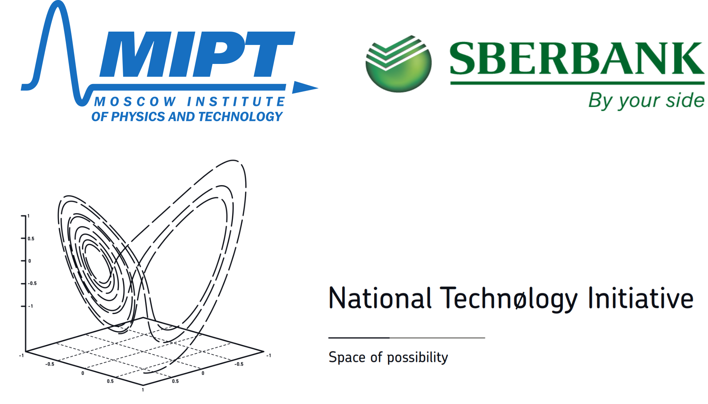

[](https://github.com/deepmipt/DeepPavlov/blob/master/LICENSE)

[](https://pepy.tech/project/deeppavlov)


DeepPavlov is an open-source conversational AI library built on [TensorFlow](https://www.tensorflow.org/) and [Keras](https://keras.io/).

DeepPavlov is designed for
* development of production ready chat-bots and complex conversational systems,
* research in the area of NLP and, particularly, of dialog systems.

## Quick Links

* Demo [*demo.ipavlov.ai*](https://demo.ipavlov.ai/)
* Documentation [*docs.deeppavlov.ai*](http://docs.deeppavlov.ai/)
    * Model List [*docs:features/*](http://docs.deeppavlov.ai/en/master/features/overview.html)
    * Contribution Guide [*docs:contribution_guide/*](http://docs.deeppavlov.ai/en/master/devguides/contribution_guide.html)
* Issues [*github/issues/*](https://github.com/deepmipt/DeepPavlov/issues)
* Forum [*forum.ipavlov.ai*](https://forum.ipavlov.ai/)
* Blogs [*ipavlov.ai/#rec108281800*](http://ipavlov.ai/#rec108281800)
* Tutorials [*examples/*](https://github.com/deepmipt/DeepPavlov/tree/master/examples)
* Docker Hub [*hub.docker.com/u/deeppavlov/*](https://hub.docker.com/u/deeppavlov/) 
    * Docker Images Documentation [*docs:docker-images/*](http://docs.deeppavlov.ai/en/master/intro/installation.html#docker-images)

**Models**

[Named Entity Recognition](http://docs.deeppavlov.ai/en/master/features/models/ner.html) | [Slot filling](http://docs.deeppavlov.ai/en/master/features/models/slot_filling.html)

[Intent/Sentence Classification](http://docs.deeppavlov.ai/en/master/features/models/classifiers.html) |  [Question Answering over Text (SQuAD)](http://docs.deeppavlov.ai/en/master/features/models/squad.html) 

[Sentence Similarity/Ranking](http://docs.deeppavlov.ai/en/master/features/models/neural_ranking.html) | [TF-IDF Ranking](http://docs.deeppavlov.ai/en/master/features/models/tfidf_ranking.html) 

[Morphological tagging](http://docs.deeppavlov.ai/en/master/features/models/morphotagger.html) | [Automatic Spelling Correction](http://docs.deeppavlov.ai/en/master/features/models/spelling_correction.html)

[ELMo training and fine-tuning](http://docs.deeppavlov.ai/en/master/apiref/models/elmo.html)

**Skills**

[Goal(Task)-oriented Bot](http://docs.deeppavlov.ai/en/master/features/skills/go_bot.html) | [Seq2seq Goal-Oriented bot](http://docs.deeppavlov.ai/en/master/features/skills/seq2seq_go_bot.html)

[Open Domain Questions Answering](http://docs.deeppavlov.ai/en/master/features/skills/odqa.html) | [eCommerce Bot](http://docs.deeppavlov.ai/en/master/features/skills/ecommerce.html) 

[Frequently Asked Questions Answering](http://docs.deeppavlov.ai/en/master/features/skills/faq.html) | [Pattern Matching](http://docs.deeppavlov.ai/en/master/features/skills/pattern_matching.html) 

**Embeddings**

[BERT embeddings for the Russian, Polish, Bulgarian, Czech, and informal English](http://docs.deeppavlov.ai/en/master/features/pretrained_vectors.html#bert)

[ELMo embeddings for the Russian language](http://docs.deeppavlov.ai/en/master/features/pretrained_vectors.html#elmo)

[FastText embeddings for the Russian language](http://docs.deeppavlov.ai/en/master/features/pretrained_vectors.html#fasttext)

**Auto ML**

[Tuning Models with Evolutionary Algorithm](http://docs.deeppavlov.ai/en/master/features/hypersearch.html)

## Installation

0. We support `Linux` and `Windows` platforms, `Python 3.6` and `Python 3.7`
    * **`Python 3.5` is not supported!**
    * **installation for `Windows` requires `Git`(for example, [git](https://git-scm.com/download/win)) and  `Visual Studio 2015/2017` with `C++` build tools installed!**

1. Create and activate a virtual environment:
    * `Linux`
    ```
    python -m venv env
    source ./env/bin/activate
    ```
    * `Windows`
    ```
    python -m venv env
    .\env\Scripts\activate.bat
    ```
2. Install the package inside the environment:
    ```
    pip install deeppavlov
    ```

## QuickStart

There is a bunch of great pre-trained NLP models in DeepPavlov. Each model is
determined by its config file.

List of models is available on
[the doc page](http://docs.deeppavlov.ai/en/master/features/overview.html) in
the `deeppavlov.configs` (Python):

```python 
    from deeppavlov import configs
```

When you're decided on the model (+ config file), there are two ways to train,
evaluate and infer it:

* via [Command line interface (CLI)](#command-line-interface-cli) and
* via [Python](#python).

Before making choice of an interface, install model's package requirements
(CLI):

```bash 
    python -m deeppavlov install <config_path>
```

* where `<config_path>` is path to the chosen model's config file (e.g.
  `deeppavlov/configs/ner/slotfill_dstc2.json`) or just name without
  *.json* extension (e.g. `slotfill_dstc2`)


### Command line interface (CLI)

To get predictions from a model interactively through CLI, run

```bash 
    python -m deeppavlov interact <config_path> [-d]
```

* `-d` downloads required data -- pretrained model files and embeddings
  (optional).

You can train it in the same simple way:

```bash
    python -m deeppavlov train <config_path> [-d]
```

Dataset will be downloaded regardless of whether there was `-d` flag or not.

To train on your own data you need to modify dataset reader path in the
[train config doc](http://docs.deeppavlov.ai/en/master/intro/config_description.html#train-config).
The data format is specified in the corresponding model doc page. 

There are even more actions you can perform with configs:

```bash 
    python -m deeppavlov <action> <config_path> [-d]
```

* `<action>` can be
    * `download` to download model's data (same as `-d`),
    * `train` to train the model on the data specified in the config file,
    * `evaluate` to calculate metrics on the same dataset,
    * `interact` to interact via CLI,
    * `riseapi` to run a REST API server (see
    [doc](http://docs.deeppavlov.ai/en/master/integrations/rest_api.html)),
    * `interactbot` to run as a Telegram bot (see
    [doc](http://docs.deeppavlov.ai/en/master/integrations/telegram.html)),
    * `interactmsbot` to run a Miscrosoft Bot Framework server (see
    [doc](http://docs.deeppavlov.ai/en/master/integrations/ms_bot.html)),
    * `predict` to get prediction for samples from *stdin* or from
      *<file_path>* if `-f <file_path>` is specified.
* `<config_path>` specifies path (or name) of model's config file
* `-d` downloads required data


### Python

To get predictions from a model interactively through Python, run

```python 
    from deeppavlov import build_model

    model = build_model(<config_path>, download=True)

    # get predictions for 'input_text1', 'input_text2'
    model(['input_text1', 'input_text2'])
```

* where `download=True` downloads required data from web -- pretrained model
  files and embeddings (optional),
* `<config_path>` is path to the chosen model's config file (e.g.
  `"deeppavlov/configs/ner/ner_ontonotes_bert_mult.json"`) or
  `deeppavlov.configs` attribute (e.g.
  `deeppavlov.configs.ner.ner_ontonotes_bert_mult` without quotation marks).

You can train it in the same simple way:

```python 
    from deeppavlov import train_model 

    model = train_model(<config_path>, download=True)
```

* `download=True` downloads pretrained model, therefore the pretrained
model will be, first, loaded and then train (optional).

Dataset will be downloaded regardless of whether there was ``-d`` flag or
not.

To train on your own data you need to modify dataset reader path in the
[train config doc](http://docs.deeppavlov.ai/en/master/intro/config_description.html#train-config).
The data format is specified in the corresponding model doc page. 

You can also calculate metrics on the dataset specified in your config file:

```python
    from deeppavlov import evaluate_model 

    model = evaluate_model(<config_path>, download=True)
```

There are also available integrations with various messengers, see
[Telegram Bot doc page](http://docs.deeppavlov.ai/en/master/integrations/telegram.html)
and others in the Integrations section for more info.


## Breaking Changes

**Breaking changes in version 0.5.0**
- dependencies have to be reinstalled for most pipeline configurations
- models depending on `tensorflow` require `CUDA 10.0` to run on GPU instead of `CUDA 9.0`
- scikit-learn models have to be redownloaded or retrained

**Breaking changes in version 0.5.0**
- dependencies have to be reinstalled for most pipeline configurations
- models depending on `tensorflow` require `CUDA 10.0` to run on GPU instead of `CUDA 9.0`
- scikit-learn models have to be redownloaded or retrained

**Breaking changes in version 0.4.0!**
- default target variable name for [neural evolution](https://docs.deeppavlov.ai/en/0.4.0/intro/hypersearch.html#parameters-evolution-for-deeppavlov-models)
was changed from `MODELS_PATH` to `MODEL_PATH`.

**Breaking changes in version 0.3.0!**
- component option `fit_on_batch` in configuration files was removed and replaced with adaptive usage of the `fit_on` parameter.

**Breaking changes in version 0.2.0!**
- `utils` module was moved from repository root in to `deeppavlov` module
- `ms_bot_framework_utils`,`server_utils`, `telegram utils` modules was renamed to `ms_bot_framework`, `server` and `telegram` correspondingly
- rename metric functions `exact_match` to `squad_v2_em` and  `squad_f1` to `squad_v2_f1`
- replace dashes in configs name with underscores

**Breaking changes in version 0.1.0!**
- As of `version 0.1.0` all models, embeddings and other downloaded data for provided configurations are
 by default downloaded to the `.deeppavlov` directory in current user's home directory.
 This can be changed on per-model basis by modifying
 a `ROOT_PATH` [variable](http://docs.deeppavlov.ai/en/master/intro/configuration.html#variables)
 or related fields one by one in model's configuration file.
 
- In configuration files, for all features/models, dataset readers and iterators `"name"` and `"class"` fields are combined
into the `"class_name"` field.

- `deeppavlov.core.commands.infer.build_model_from_config()` was renamed to `build_model` and can be imported from the
 `deeppavlov` module directly.

- The way arguments are passed to metrics functions during training and evaluation was changed and
 [documented](http://docs.deeppavlov.ai/en/0.4.0/intro/config_description.html#metrics).

## License

DeepPavlov is Apache 2.0 - licensed.

## The Team

DeepPavlov is built and maintained by [Neural Networks and Deep Learning Lab](https://mipt.ru/english/research/labs/neural-networks-and-deep-learning-lab) at [MIPT](https://mipt.ru/english/) within [iPavlov](http://ipavlov.ai/) project (part of [National Technology Initiative](https://asi.ru/eng/nti/)) and in partnership with [Sberbank](http://www.sberbank.com/).

<p align="center">

</p>
