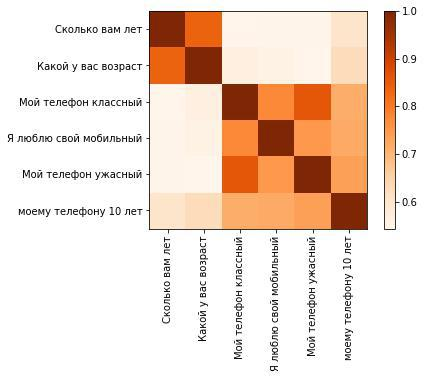

[](/LICENSE.txt)


# CoVe
**Context Vector embedder**
<p align="center">
 
</p>
<p align="center">
 <em> Cove contexts similarity example </em>
</p>

The work is inspired by the article [Learned in Translation: Contextualized Word Vectors](https://arxiv.org/abs/1708.00107) and the related [code](https://github.com/salesforce/cove) in PyTorch.

This component serves for obtaining the feature vector for the sentence, but could be also used to return multiple vectors — one for each token in the sentence as well.

Provided code makes it possible to use encoder from any trained NMT model from [OpenNMT-tf catalog](http://opennmt.net/OpenNMT-tf/package/opennmt.models.catalog.html) (which use multilayer bidirectional recurrent encoder) to embedd input sentence.

At the moment only models that don't use pretrained vectors (e.g. GloVe, FastText) are allowed.
Moreover, trained CoVe model for Russian is available. The model uses [bpe tokenizer](../../tokenizers/bpe_tokenizer.py) and was trained on the parallel [corpus from Yandex](https://translate.yandex.ru/corpus).
Thus, you can infer provided model to obtain context vector for Russian language.


## Model usage

This example assumes that the working directory is the root of the project.

```python
from deeppavlov.core.commands.infer import build_model_from_config
from deeppavlov.download import deep_download
import json
PIPELINE_CONFIG_PATH = 'deeppavlov/configs/cove_embedder/cove_ru_medium_onmt.json'

with open(PIPELINE_CONFIG_PATH) as f:
    config = json.load(f)
deep_download(['-c', PIPELINE_CONFIG_PATH])
cove = build_model_from_config(config)
vecs = cove(['Дайте мне еще этих вкусных французских булочек', 'Невыносимая легкость бытия'])
print(vecs.shape)
# (2, 512)
```


## Model training

In order to train a new model use [OpenNMT-tf documentation guides](http://opennmt.net/OpenNMT-tf/).

The *following* quickstart example has been borrowed from the original [documentation](https://github.com/OpenNMT/OpenNMT-tf#quickstart).
It trains the `NMTSmall` model from the [catalog](https://github.com/OpenNMT/OpenNMT-tf/blob/master/opennmt/models/catalog.py).

1\. Clone the repository to fetch the sample data and the predefined configurations:

```
git clone --depth 1 --branch r1 --single-branch https://github.com/OpenNMT/OpenNMT-tf.git
cd OpenNMT-tf
```

2\. Build the word vocabularies:

```
onmt-build-vocab --size 50000 --save_vocab data/toy-ende/src-vocab.txt data/toy-ende/src-train.txt
onmt-build-vocab --size 50000 --save_vocab data/toy-ende/tgt-vocab.txt data/toy-ende/tgt-train.txt
```

3\. Train with preset parameters:

```
onmt-main train_and_eval --model_type NMTSmall --config config/opennmt-defaults.yml config/data/toy-ende.yml
```

4\. Translate a test file with the latest checkpoint:

```
onmt-main infer --config config/opennmt-defaults.yml config/data/toy-ende.yml --features_file data/toy-ende/src-test.txt
```

After the train has been completed you need to provide the following parameters (of your openNMT model) to use trained encoder separately:
* **checkpoint_path** — path to your last checkpoint (in the format `"/path/to/model.ckpt-326107"`)
* **vocab_file_path** — path to the vocabulary, which is actually should be a file containing one token per line and three special tokens. Example of the format is below:

        <blank>
        <s>
        </s>
        a
        he
        in
        town
  as for the quickstart example above, *vocab_file_path* would be `"data/toy-ende/src-train.txt"`
* **cell_class_name** — name of the recurrent cell used in the encoder implementation from the OpenNMT-tf. At the moment only the cells from the `tf.contrib.rnn` are supported.
    If you use the model from [opennmt/models/catalog](https://github.com/OpenNMT/OpenNMT-tf/blob/master/opennmt/models/catalog.py) as in the quickstart example,
    the *cell_class_name* would be `"LSTMCell"`
* **residual_connections** — `False` for all onmt catalog models, but you can experiment with it in your own NMT model.
* **num_units** — number of units in each recurrent cell, see opennmt [code](https://github.com/OpenNMT/OpenNMT-tf/blob/master/opennmt/models/catalog.py) for reference.
As for the quickstart example, *num_units* would be 512.
* **num_layers** — number of recurrent layers, for the quickstart example, *num_layers* would be 2.
* **reduce_method** — method to transform concatenated vectors from the last layer of the bi-lstm encoder (number_of_tokens vectors of size num_units*2]) to the one sentence vector.
The following reducers are available:
    - `"mean"` — return mean vector of size \[num_units*2]
    - `"sum"` — return sum vector of size \[num_units*2]
    - `"max"` — return vector with max values for each dimension of token vectors, return size \[num_units*2]
    - `"none"` — use it to get vectors from encoder without reducing (i.e. \[number_of_tokens, num_units*2])

These parameters could be provided as a python dict or using configuration file (see for example `deeppavlov/configs/cove_embedder/cove_ru_medium_onmt.json`).
In the example config [bpe_tokenizer](../../tokenizers/bpe_tokenizer.py) is used, but it is optional to train the model with bpe tokens.