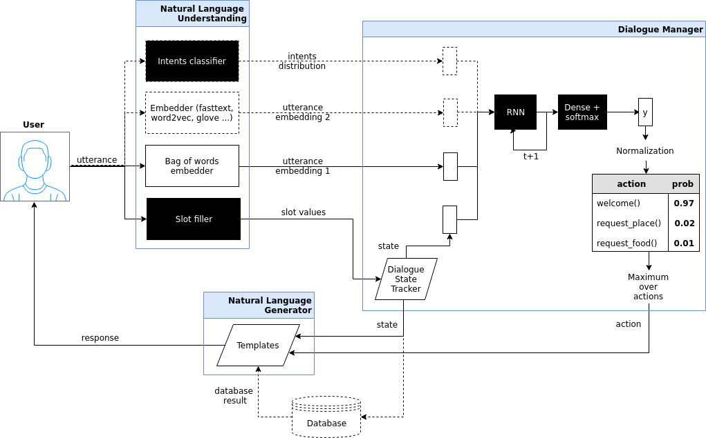

[](/LICENSE.txt)


# Dialogue Bot for goal-oriented task 
The dialogue bot is based on [[1]](#references) which introduces Hybrid Code Networks (HCNs) that combine an RNN with domain-specific knowledge and system action templates.


**Diagram 1.** Dotted lines correspond to unrequired (optional) modules, black squares to trained models, trapezes are modules that depend on a dataset and must be provided by software developer.

Here is a simple example of interaction with a trained dialogue bot (can be downloaded with [`deeppavlov/download.py`](../../download.py)):

```
:: 
>> Hello, welcome to the Phystech restaurant system. You can ask for restaurants by area, price range or food type. How may I help you?
:: hi, i want some food
>> What part of town do you have in mind?
:: north of Dolgoprudny
>> Would you like something in the cheap, moderate, or expensive price range?
:: something chep, please
>> "Time to eat" is a nice place in the north of town and the prices are cheap.
:: what kind of food does it serve? 
>> "Time to eat" serves russian food.
:: i like that! give me their address then
>> Sure, "Time to eat" is on Sobina Square, 1/4.
:: and phone number. In case i wanted anything for delivery.
>> The phone number of "Time to eat" is +7(965)173-37-33.
:: I won't need that, but give me their post code too.
>> The post code of "Time to eat" is 141700.
:: nice, thanks!
>> "Time to eat" is a nice place in the centre of town serving tasty creative food.
:: good bye
>> You are welcome!
:: exit
```

## Usage

#### Requirements

To use a go_bot model you should have:
1. (_optional, but recommended_) pretrained named entity recognition model (NER) 
   * config [`deeppavlov/configs/ner/ner_dstc2.json`](../../configs/ner/ner_dstc2.json) is recommended
2. (_optional, but recommended_) pretrained intents classifier model 
   * config [`deeppavlov/configs/intents/intents_dstc2.json`](../../configs/intents/intents_dstc2.json) is recommended
3. (_optional_) downloaded english fasttext embeddings trained on wiki ([https://s3-us-west-1.amazonaws.com/fasttext-vectors/wiki.en.zip](https://s3-us-west-1.amazonaws.com/fasttext-vectors/wiki.en.zip))
   * fasttext embeddings can loaded via `python3 deeppavlov/download.py --all`
   * you can use any english embeddings of your choice, but edit go_bot config accordingly
4. pretrained vocabulary of dataset utterance tokens
   * it can be trained alongside go_bot model
4. pretrained goal-oriented bot model itself 
   * config [`deeppavlov/configs/go_bot/gobot_dstc2.json`](../../configs/go_bot/gobot_dstc2.json) is recommended
   * `slot_filler` section of go_bot's config should match NER's configuration
   * `intent_classifier` section of go_bot's config should match classifier's configuration
   * double-check that corresponding `load_path`s point to NER and intent classifier model files

#### Config parameters:
* `name` always equals to `"go_bot"`
* `template_path` — map from actions to text templates for response generation
* `use_action_mask` — in case of true, action mask is applied to network output _(False, by default)_
* `db_result_during_interaction` – dict (or `null`) that will be observation's `"db_result"` value during interaction (when database is not available) _(optional)_
* `word_vocab` — vocabulary of tokens from context utterances
   * `name` — `"default_vocab"` (for vocabulary's implementation see [`deeppavlov.core.data.vocab`](../../core/data/vocab.py))
   * `level` — `"token"`,
   * `tokenizer` — `{ "name": "split_tokenizer" }`,
   * `save_path` — `"vocabs/token.dict"`
   * `load_path` — `"vocabs/token.dict"`
* `tokenizer` — one of tokenizers from [`deeppavlov.models.tokenizers`](../../models/tokenizers) module
   * `name` — tokenizer name
   * other arguments specific to your tokenizer
* `bow_embedder` — [`deeppavlov.models.embedders.bow_embedder`](../../models/embedders/bow_embedder.py) or `null` _(optional)_
   * `name` — embedder name
   * other arguments specific to your bag of words embedder
* `embedder` — one of embedders from [`deeppavlov.models.embedders`](../../models/embedders) module _(optional)_
   * `name` — embedder name (`"fasttext"` recommended, see [`deeppavlov.models.embedders.fasttext_embedder`](../../models/embedders/fasttext_embedder.py))
   * other arguments specific to your embedder
* `tracker` — dialogue state tracker from [`deeppavlov.models.trackers`](../../models/trackers)
   * `name` — tracker name (`"default_tracker"` or `"featurized_tracker"` recommended)
   * `slot_vals` — list of slots that should be tracked
* `network_parameters` — parameters for reccurent network that handles dialogue policy management
   * `save_path` — name of the file that the model will be saved to
   * `load_path` — name of the file that the model will be loaded from
   * `learning_rate` — learning rate during training
   * `dropout_rate` — rate for dropout layer applied to input features
   * `hidden_dim` — hidden state dimension
   * `dense_size` — LSTM input size
   * `obs_size` — input features size (must be set to number of `bow_embedder` features, `embedder` features, `intent_classifier` features, context features(=2) plus `tracker` state size plus action size), will be calculated automatically if not set _(optional)_
   * `action_size` — output action size, will be calculated automatically if not set _(optional)_
   * `attention_mechanism` – dict (or `null`) that describes attention applied to network inputs:
   * `attention_mechanism.type` – type of attention mechanism, one of (`"general"`, `"bahdanau"`, `"light_general"`, `"light_bahdanau"`, `"cs_general"`, `"cs_bahdanau"`)
   * `attention_mechanism.hidden_size` – attention hidden state size
   * `attention_mechanism.max_num_tokens` – maximum number of input tokens used in attentio
   * `attention_mechanism.depth` – number of averages used in constrained attentions (`"cs_bahdanau"` or `"cs_general"`)
   * `attention_mechanism.action_as_key` – whether to use action from previous timestep as key to attention (defaults to `false`) _(optional)_
   * `attention_mechanism.intent_as_key` – whether to use utterance intents as key to attention (defaults to `false`) _(optional)_
   * `attention_mechanism.projected_align` – whether to use output projection (defaults to `false`) _(optional)_
* `slot_filler` — model that predicts slot values for a given utterance
   * `name` — slot filler name (`"dstc_slotfilling"` recommended, for implementation see [`deeppavlov.models.ner`](../../models/ner))
   * other slot filler arguments
* `intent_classifier` — model that outputs intents probability distribution for a given utterance
   * `name` — intent classifier name (`"intent_model"` recommended, for implementation see [`deeppavlov.models.classifiers.intents`](../../models/classifiers/intents))
   * classifier's other arguments
* `debug` — whether to display debug output (defaults to `false`) _(optional)_

For a working exemplary config see [`deeeppavlov/configs/go_bot/gobot_dstc2.json`](../../configs/go_bot/gobot_dstc2.json) (model without embeddings).

A minimal model without `slot_filler`, `intent_classifier` and `embedder` is configured in [`deeeppavlov/configs/go_bot/gobot_dstc2_minimal.json`](../../configs/go_bot/gobot_dstc2_minimal.json).

A full model (with fasttext embeddings) configuration is in [`deeeppavlov/configs/go_bot/gobot_dstc2_all.json`](../../configs/go_bot/gobot_dstc2_all.json).

The best state-of-the-art model (with attention mechanism, relies on `embedder` and does not use bag-of-words) is configured in [`deeeppavlov/configs/go_bot/gobot_dstc2_best.json`](../../configs/go_bot/gobot_dstc2_best.json).

#### Usage example
* To infer from a pretrained model with config path equal to `path/to/config.json`:

```python
from deeppavlov.core.commands.infer import build_model_from_config
from deeppavlov.core.common.file import read_json

CONFIG_PATH = 'path/to/config.json'
model = build_model_from_config(read_json(CONFIG_PATH))

utterance = ""
while utterance != 'exit':
    print(">> " + model([utterance])[0])
    utterance = input(':: ')
```

* To interact via command line use [`deeppavlov/deep.py`](../../deep.py) script:

```bash
cd deeppavlov
python3 deep.py interact path/to/config.json
```

## Training

#### Config parameters
To be used for training, your config json file should include parameters:

* `dataset_reader`
   * `name` — `"your_reader_here"` for a custom dataset or `"dstc2_datasetreader"` to use DSTC2 (for implementation see [`deeppavlov.dataset_readers.dstc2_dataset_reader`](../../dataset_readers/dstc2_dataset_reader.py))
   * `data_path` — a path to a dataset file, which in case of `"dstc2_datasetreader"` will be automatically downloaded from 
   internet and placed to `data_path` directory
* `dataset_iterator` — it should always be set to `{"name": "dialog_iterator"}` (for implementation see [`deeppavlov.dataset_iterators.dialog_iterator.py`](../../dataset_iterators/dialog_iterator.py))

See [`deeeppavlov/configs/go_bot/gobot_dstc2.json`](../../configs/go_bot/gobot_dstc2.json) for details.

#### Train run
The easiest way to run the training is by using [`deeppavlov/deep.py`](../../deep.py) script:

```bash
cd deeppavlov
python3 deep.py train path/to/config.json
```

## Datasets

#### DSTC2
The Hybrid Code Network model was trained and evaluated on a modification of a dataset from Dialogue State Tracking Challenge 2 [[2]](#references). The modifications were as follows:
* **new actions**
    * bot dialog actions were concatenated into one action (example: `{"dialog_acts": ["ask", "request"]}` -> `{"dialog_acts": ["ask_request"]}`)
    * if a slot key was associated with the dialog action, the new act was a concatenation of an act and a slot key (example: `{"dialog_acts": ["ask"], "slot_vals": ["area"]}` -> `{"dialog_acts": ["ask_area"]}`)
* **new train/dev/test split**
    * original dstc2 consisted of three different MDP polices, the original train and dev datasets (consisting of two polices) were merged and randomly split into train/dev/test
* **minor fixes**
    * fixed several dialogs, where actions were wrongly annotated
    * uppercased first letter of bot responses
    * unified punctuation for bot responses'

#### Your data
If your model uses DSTC2 and relies on `dstc2_datasetreader` [`DatasetReader`](../../core/data/dataset_reader.py), all needed files, if not present in the `dataset_reader.data_path` directory, will be downloaded from internet.

If your model needs to be trained on different data, you have several ways of achieving that (sorted by increase in the amount of code):

1. Use `"dialog_iterator"` in dataset iterator config section and `"dstc2_datasetreader"` in dataset reader config section (**the simplest, but not the best way**):
    * set `dataset_iterator.data_path` to your data directory;
    * your data files should have the same format as expected in [`deeppavlov.dataset_readers.dstc2_dataset_reader:DSTC2DatasetReader.read()`](../../dataset_readers/dstc2_dataset_reader.py) function.

2. Use `"dialog_iterator"` in dataset iterator config section and `"your_dataset_reader"` in dataset reader config section (**recommended**): 
    * clone [`deeppavlov.dataset_readers.dstc2_dataset_reader:DSTC2DatasetReader`](../../dataset_readers/dstc2_dataset_reader.py) to `YourDatasetReader`;
    * register as `"your_dataset_reader"`;
    * rewrite so that it implements the same interface as the origin. Particularly, `YourDatasetReader.read()` must have the same output as `DSTC2DatasetReader.read()`:
      * `train` — training dialog turns consisting of tuples:
         * first tuple element contains first user's utterance info
            * `text` — utterance string
            * `intents` — list of string intents, associated with user's utterance
            * `db_result` — a database response _(optional)_
            * `episode_done` — set to `true`, if current utterance is the start of a new dialog, and `false` (or skipped) otherwise _(optional)_
         * second tuple element contains second user's response info
            * `text` — utterance string
            * `act` — an act, associated with the user's utterance
      * `valid` — validation dialog turns in the same format
      * `test` — test dialog turns in the same format
      
#TODO: change str `act` to a list of `acts`

3. Use your own dataset iterator and dataset reader (**if 2. doesn't work for you**):
    * your `YourDatasetIterator.iter()` class method output should match the input format for chainer from [`configs/go_bot/gobot_dstc2.json`](../../configs/go_bot/gobot_dstc2.json).

## Comparison
As far as our dataset is a modified version of official DSTC2-dataset [[2]](#references), resulting metrics can't be compared with evaluations on the original dataset.

But comparisons for bot model modifications trained on out DSTC2-dataset are presented:

|                   Model                      | Config      |  Test action accuracy   |  Test turn accuracy  |
|----------------------------------------------|-------------|-------------------------|----------------------|
|basic bot			                               | [`gobot_dstc2_minimal.json`](../../configs/go_bot/gobot_dstc2_minimal.json) | 0.5271             |     0.4853           |
|bot with slot filler & fasttext embeddings    |        |      0.5305             |     0.5147           |
|bot with slot filler & intents                | [`gobot_dstc2.json`](../../configs/go_bot/gobot_dstc2.json)                 |   0.5436         |     0.5261       |
|bot with slot filler & intents & embeddings   | [`gobot_dstc2_all.json`](../../configs/go_bot/gobot_dstc2_all.json)         |      0.5307             |     0.5145           |
|bot with slot filler & embeddings & attention   | [`gobot_dstc2_best.json`](../../configs/go_bot/gobot_dstc2_best.json)         |      **0.5921**             |     **0.5805**           |

#TODO: add dialog accuracies

# References
[1] [Jason D. Williams, Kavosh Asadi, Geoffrey Zweig, Hybrid Code Networks: practical and efficient end-to-end dialog control with supervised and reinforcement learning – 2017](https://arxiv.org/abs/1702.03274)

[2] [Dialog State Tracking Challenge 2 dataset](http://camdial.org/~mh521/dstc/)
