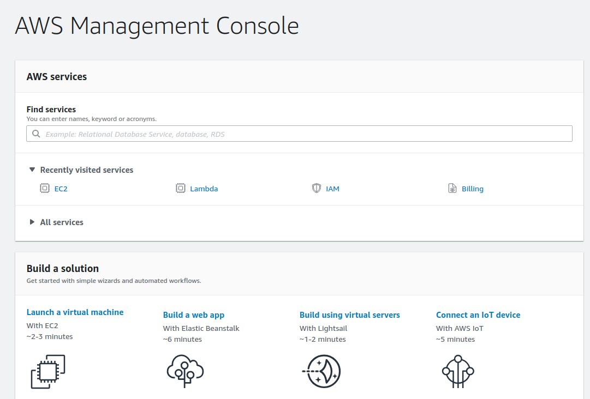
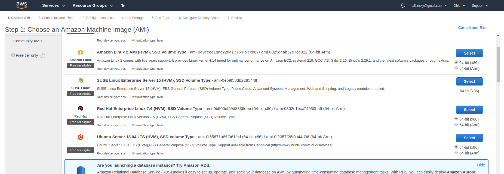
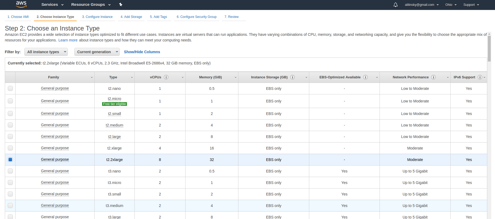
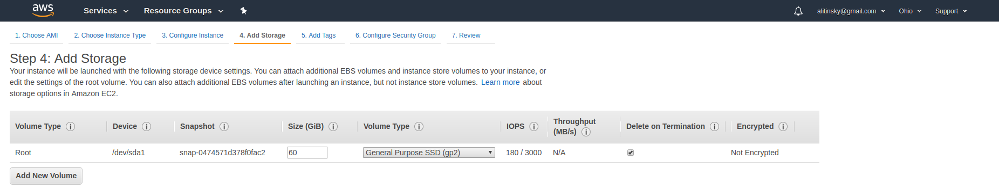
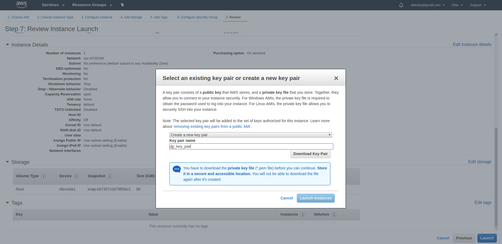
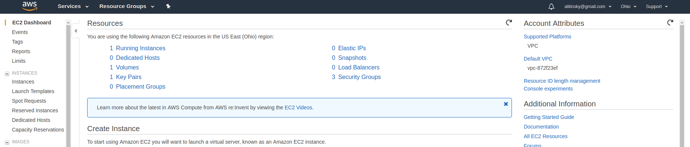
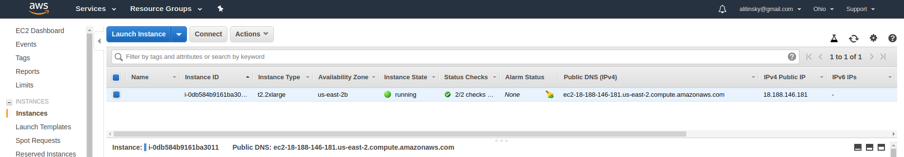

Amazon AWS deployment
=====================

Here is a manual for deployment DeepPavlov (with ODQA as example) in Amazon Web Services using EC2 virtual machine.

Deployment process consists of two main stages:

1. AWS EC2 machine launch
2. DeepPavlov ODQA deployment

1. AWS EC2 machine launch
-------------------------

1.  Login to your AWS console and proceed to the EC2 services dashboard.

2.  Choose Ubuntu Server 18.04 LTS 64-bit x86 machine.

3.  You should select appropriate instance type because of high memory consumption by ODQA.
    32 GiB memory is a minimum. Then press *"Next: ..."*

4.  Proceed to Step 4. Your instance storage size should be no less than 50 GiB to
    store ODQA models.

5.  Proceed to Step 7. Check your instance parameters and press *"Launch"* button.
    You will be prompted to create and save security key pair for further access to your instance.

6.  Return to your EC2 services dashboard and navigate to your running instances list.

7.  Wait until instance initializing finishes (instance status become *"running"*).

8.  To make DeepPavlov ODQA model rest API accessible from Internet you should set
    corresponding inbound security rules:

    8.1 Navigate to your instance security group dashboard
    (in this example security group has name *"launch-wizard-2"*).

    .. image:: ../_static/aws_ec2/08_01_set_sec_group.png
       :width: 800

    8.2 Select *"Inbound"* rules tab, click *"Edit"*, then click *"Add Rule"*.
    For your new rule select *"Custom TCP Rule"* type, *"Anywhere"* source and input
    port for your ODQA API. Click *"Save"*.

    .. image:: ../_static/aws_ec2/08_02_set_inbound.png
       :width: 800

9.  Connecting to your instance by SSH:

    9.1 Navigate to your instance dashboard, right-click your instance, select *"Connect"*.

    .. image:: ../_static/aws_ec2/09_01_select_connect.png
       :width: 800

    You will be redirected to connection instructions screen for your dashboard.
    Follow instructions for standalone SSH client. SSH connection bash command example will
    already contain valid user and host name. To connect to your Amazon instance just run
    the example with valid path to your saved key pair (instead of *"dp_key_pair.pem"*
    in this example).

    .. image:: ../_static/aws_ec2/09_02_connection_info.png
       :width: 800

2. DeepPavlov ODQA deployment
-----------------------------

1.  Login to your AWS EC2 instance.

2.  For now DeepPavlov requires Python 3.6 to run. Below are instructions for DeepPavlov ODQA
    deployment under Ubuntu 18.04 (which has pre-installed Python 3.6) and virtualenv.

3.  Install pip3:

    ``sudo apt update``

    ``sudo apt install python3-pip``

4.  Install virtualenv:

    ``sudo pip3 install virtualenv``

5.  Create and activate Python 3.6 virtual enviroment:

    ``virtualenv env -p python3.6``

    ``source env/bin/activate``

6.  Install DeepPavlov:

    ``pip install deeppavlov``

7.  Install ODQA dependencies:

    ``python -m deeppavlov install en_odqa_pop_infer_enwiki20180211``

8.  Download ODQA models (it will take quite a time):

    ``python -m deeppavlov download en_odqa_pop_infer_enwiki20180211``

9.  Run ODQA REST API service, where <port> is port you defined in TCP
    inbound rules for your AWS instance:

    ``python -m deeppavlov riseapi en_odqa_pop_infer_enwiki20180211 -p <port>``

3. Accessing your ODQA API
--------------------------

1.  Get your AWS instance public DNS from the instance dashboard.

2.  Get full info about your ODQA API from its Swagger by navigating to
    following URL in your browser:

    ``http://<your_aws_instance_public_dns>:<your_odqa_service_port>``
