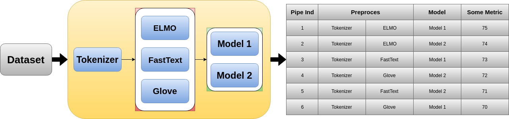
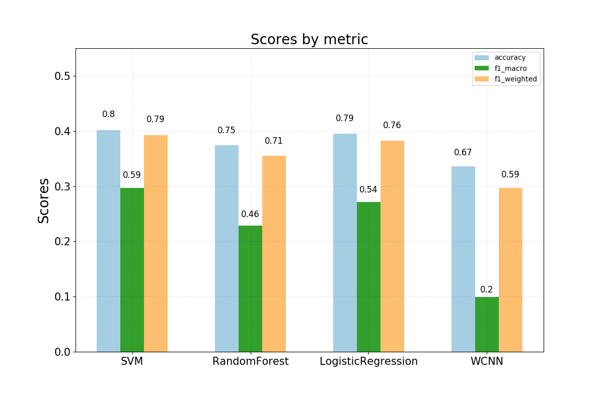
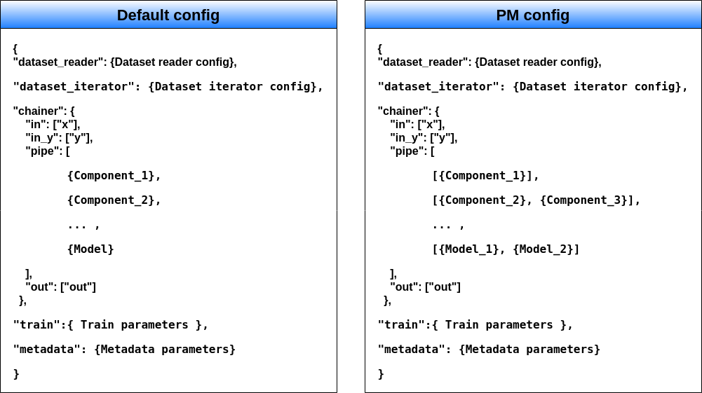

Pipeline Manager
================

Introduction:
-------------
When conducting research, a situation may arise in which a series of experiments that are similar to each other are
required. For example, you solve the problem of classifying intents, you have the opportunity to use a number of
different embeddingings. Suppose some were trained on more data, while others were trained on data that belongs to the
same domain as your dataset. You can not say exactly which embeddings will give a better score. As a result, you want
to try to train the model with all embeddings, and then compare the results. Or you have a set of different neural
architectures that solve the same problem, you want to know the quality of work of all models, and then compare with
each other. Or maybe both. The :class:`~deeppavlov.pipeline_manager.PipelineManager` is designed to automate
experiments of this kind.

|alt text| **Diagram 1.**

The structure of the experiment and its parameters, for example, to save checkpoints for all experiments or only for
the best, is described as a special json config, and is given to the :class:`~deeppavlov.pipeline_manager.PipelineManager`
class as an argument when it is initialized. Based on these data, and using the DeepPavlov library's functionality,
the class automatically runs all the experiments described in the config, saves their description and results, and
finally builds a table with xlsx resolution, in which the experiments are sorted in descending order by the target
metric, and a plot with a histogram of results.

|alt text2| **Plot 1.** Example of histogram with results.

Experiments can be run both sequentially and in parallel. Including on video cards, in the event that you have several.
Also, the :class:`~deeppavlov.pipeline_manager.PipelineManager` class functionality allows for the selection of
hyperparameters for individual models. “Random search” and “grid search” are available.

Running a large number of experiments, especially with large neural models, may take a large amount of time.
It would be very unpleasant if you lose a few hours (or even more) due to some kind of error somewhere in the middle
of the process. To avoid this a special test was added to check the correctness of the joints of individual blocks in
all pipelines, or another errors. During the test, all pipelines are trained on a small piece of the original dataset,
and performs everything except the construction of the final report. Including building a folder tree, as well as saving
intermediate checkpoints, in the folder “~/checkpoints/tmp/”, after successfully passing the test, the folder is
automatically deleted. If the test is not successful, the “~/checkpoints/tmp/” folder with all its contents
remains for debugging. When you run the test again, all content from the past test will be deleted.

If the test passed without errors, you can not worry about the experiment. A normal experiments is automatically
started after test. The test starts, nothing else needs to be done, but it can also be turned off. In this case,
the experiment will start immediately. Test supports multiprocessing.

Usage
-----
First you would need to install additional requirements:

.. code:: bash

    python -m deeppavlov install <path_to_config>

After you wrote your config file, you can run your experiment by running in terminal command:

.. code:: bash

    python -m deeppavlov pipeline_search <path_to_config> [-d]

The ``-d`` parameter downloads

   - data required to train your model (embeddings, etc.);
   - a pretrained model if available (provided not for all configs).

Also you can run :class:`~deeppavlov.pipeline_manager.PipelineManager` in code:

.. code:: python

    from deeppavlov.pipeline_manager import PipelineManager

    pipeman = PipelineManager("path to your config file or config dict")
    pipeman.run()

**Examples:**
For a quick start, you can run test experiment on Snips dataset by this command from bash:

.. code:: bash

    python -m deeppavlov pipeline_search deeppavlov/configs/pipeline_manager/linear_classification.json. -d

Config description for Pipeline Manager:
----------------------------------------
Description of the structure of the experiments and the logic of the work of the
:class:`~deeppavlov.pipeline_manager.PipelineManager` class, is also described by the config file. Its main
difference from the :doc:`config_description </intro/config_description>` is that each element of the chainer can now be a list:

|alt text3| **Diagram 2.** Conceptual example of :class:`~deeppavlov.pipeline_manager.PipelineManager` config.

Thus, in place of a component, there can now be a list of components for enumeration. And during the work of the
:class:`~deeppavlov.pipeline_manager.PipelineManager`, it will launch a full-fledged experiment with each of
them separately.

.. note::

    **WARNING!:** All components listed in one list must accept the same data type and format as input and output it.
    In other words, all components within the list should be compatible with their closest neighbors. Otherwise, an
    error will occur.

It is also recommended to add the key "component_name" (with the name of the component that will be displayed in the
summary table) in the description of the parameters of all components of the ``Chainer``. If this key is not in the
description of the component, then the ConfigError will appear.

The :class:`~deeppavlov.pipeline_manager.PipelineManager` operation mode is defined by the parameters:
 - **exp_name**
 - **root**
 - **do_test**
 - **search_type**
 - **sample_num**
 - **plot**
 - **save_best**
 - **multiprocessing**
 - **max_num_workers**
 - **use_all_gpus**
 - **use_multi_gpus**
 - **gpu_memory_fraction**

This parameters are defined in the config file under the key “enumerate”. Here is simplify example:

.. code:: python

    {
        "dataset_reader": {...},
        "dataset_iterator": {...},
        "chainer": {
            "in": ["x"],
            "in_y": ["y"],
            "pipe": [ ... ],
            "out": ["pred_labels"]
            },
        "train": {...},
        "metadata": {...},
        "enumerate": {
            "exp_name": "lin_clf",
            "root": "./download/experiments/",
            "do_test": false,
            "search_type": "random",
            "sample_num": 10,
            "plot": false,
            "save_best": true,
            "multiprocessing": true,
            "max_num_workers": 4,
            "use_all_gpus": True,
            "use_multi_gpus": null,
            "gpu_memory_fraction": 1.0
            }
    }

You can look at the full config file for Pipeline Manager here :config:`deeppavlov/configs/pipeline_manager/linear_classification.json <linear_classification.json>`.

Directories structure
---------------------
When you start the work of the :class:`~deeppavlov.pipeline_manager.PipelineManager` in the path specified
through the parameter **root**, the following structure is created:

- {**root**}/
    - **date**/
        - **exp_name**/
            - checkpoints/
                if **save_best** is False:
                    - "dataset_name"/
                        - pipe_1/
                            - config.json
                            - out.txt
                            - [others checkpoints files]
                        - pipe_2/

                        - ...

                        - [common files to all pipelines (for example vocabs or tf-idf)]

                Else:
                    - "dataset_name"_best_pipe/
                        - pipe_n/
                            - config.json
                            - out.txt
                            - [others checkpoints files]
                            - [common files to all pipelines (for example vocabs or tf-idf)]

            - images/  # creating if **plot** is True, in the end of algorithm
                - "dataset_name".png
            - **exp_name**.json
            - Report_exp_name_date.xlsx  # creating in the end of algorithm

**Explanations:**
 - The file “Report_exp_name_date.xlsx” is a summary table and is created only at the end of the algorithm, after the
   completion of all experiments.
 - The file **exp_name**.json is the log of the whole experiment, it contains a description of all the running
   experiments, their results, the time of the experiment, etc. It is created at the start of the algorithm, and is
   updated throughout the entire algorithm.
 - “dataset_name” is the name of the folder in which the dataset is located, automatically parsed from the
   dataset_reader parameters in the experiment config.
 - The “checkpoints/” folder is created when the algorithm is launched, and is updated throughout its operation.
 - The file “checkpoints/dataset_name/pipe_{x}/config.json” is the default DP configuration for the pipeline
   “pipe_{x}” with all the necessary dependencies. So if you want to run the model trained in “pipe_{x}” to be
   validated or inferenced, you do not need to write the config again, it will be enough to refer to this file.
 - The file “checkpoints/dataset_name/pipe_{x}/out.txt” contains the contents of the std.err and std.out
   streams received from the training “pipe_{x}”.
 - At the moment, if the **save_best** parameter is True, then during the operation of the algorithm, the checkpoints
   of all pipelines are saved in the “checkpoints/dataset_name/" folder, and only after all the pipelines are
   completed, the best ones are calculated and all the others are deleted. In the near future it will be fixed.

Hyperparameter search
---------------------
We can say that when you run an experiment with :class:`~deeppavlov.pipeline_manager.PipelineManager`, we perform
greed search on the components entered into the config. However, in addition to this, :class:`~deeppavlov.pipeline_manager.PipelineManager`
also allows hyperparameter search. In order to specify how and which components have which parameters to iterate, it is required in the config when
describing the class parameters of a component, instead of an attribute value, specify a dictionary describing the
type of search, for example:

.. code:: python

    {
        "chainer": {
            "in": ["x"],
            "in_y": ["y"],
            "pipe": [
                [...],
                ... ,
                [
                    {
                     "in": ["x_vec"],
                     "out": ["y_pred_probas"],
                     "fit_on": ["x_vec", "y_ids"],
                     "class_name": "sklearn_component",
                     "C": {"random_range": [0.01, 2.0]},
                     "fit_intercept": {"random_bool": true},
                     "class_weight": {"random_choice": [null, "balanced"]},
                     "solver": {"random_choice": ["lbfgs", "newton-cg"]}
                    }
                ]
            ],
            "out": ["y_pred_labels"]
        }
    }

As you can see from the example, in the dictionaries with the description of the search, there are different keys
[**random_bool**, **random_choice**, **random_range**], and as you may have guessed, they determine the effect of
sampling.

In the case of **random_bool**, the attribute value is randomly taken as True or False (and no matter what the value
of this key is). In the case of **random_choice**, one of the elements of the presented list is randomly selected.
And with **random_range** a number from the specified range is sampled randomly.

For the latter case, additional parameters **discrete**, **scale** are provided. The first one takes boolean values,
if it is True, then only integers will be sampled from the specified range, the default value is False. The second
one takes values from [None, “log”], if the parameter is “log”, then sampling will take place on a logarithmic scale,
the default value is None. Thus, a dictionary can be defined:

.. code:: python

    ...
    "C": {"random_range": [1, 1000], "discrete": true, "scale": "log"},
    ...

And then whole numbers will be sampled from the range [1, 1000] on a logarithmic scale.

In the case of grid_search, only the **grid_search** key is provided with no additional parameters.

To understand how different sets of hyperparameters are sampled against the background of component lookup, consider
the case from the introduction (shown in the picture), we want to try two models and three different embeds,
resulting in six different pipelines. If in one of these pipelines a component is encountered with the search of
parameters, then hyperparameter search will start. If we add a parameter enumeration to the description of one of the
models and use random_search using the default value of **sample_num**, we will end up with 33 pipelines, not 6.

There are two sheets in the summary table for this case of these, a sorted table with all pipelines and their results,
in this case 33, and another sorted table with only 6 pipelines, where the best values ​​were taken as pipelines for
which parameters were selected.

