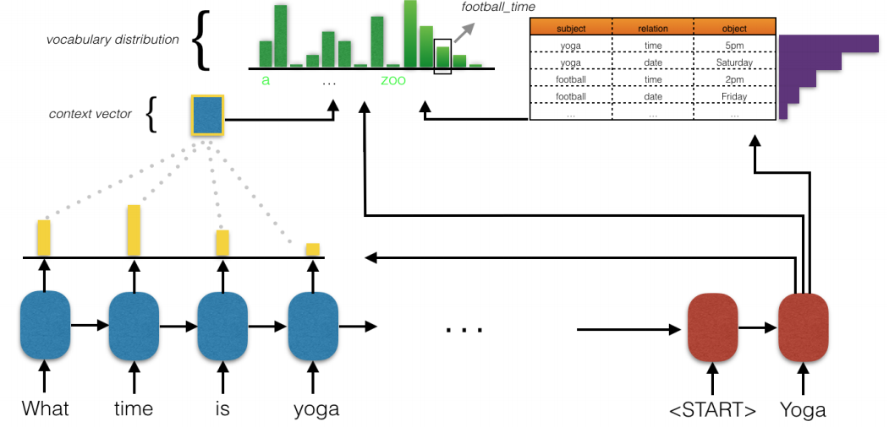

Sequence-To-Sequence Dialogue Bot For Goal-Oriented Task
========================================================

Pretrained on KVRET dataset (English) model is available. Try it by running:

.. code:: python

    from deeppavlov import build_model, configs

    bot = build_model(configs.seq2seq_go_bot.bot_kvret, download=True)

    dialog_id = '2b77c100-0fec-426a-a483-04ac03763776'
    bot(['Hi! Where is the nearest gas station?'], [dialog_id])
    bot(['Thanks, bye'], [dialog_id])

If you're missing some required packages, install all the requirements by running in command line:

.. code:: bash

   python -m deeppavlov install bot_kvret 

Intro
-----

A goal-oriented bot based on a rnn that encodes user utterance and generates 
response in a sequence-to-sequence manner. For network architecture is similar
to [1]_.

|alt text| **Diagram 1.**  Key-value retrieval network.
For each time-step of decoding, the cell state is used to compute
an attention over the encoder states and a separate attention
over the key of each entry in the KB. The attentions over the encoder
are used to generate a context vector which is combined with the cell state to
get a distribution over the normal vocabulary.
The attentions over the keys of the KB become the logits
for their associated values and are separate entries in a
now augmented vocabulary that we argmax over.

The dialogue agent is able to handle multi-domain data. The model is
end-to-end differentiable and does not need to explicitly model dialogue 
state or belief trackers.

We also used a new Stanford NLP Group released dataset of 3,031 dialogues
[2]_ that are grounded through underlying knowledge bases
and span three distinct tasks in the in-car personal assistant space:

    - calendar scheduling,
    - weather information retrieval and
    - point-of-interest navigation.

For more info on the dataset see :class:`~deeppavlov.dataset_readers.kvret_reader.KvretDatasetReader`.

Here is a simple example of interaction with a trained dialogue bot (available for download):

.. code:: text

    x_text:: Where is the nearest gas station?
    dialog_id:: 2b77c100-0fec-426a-a483-04ac03763776
    >> chevron is the nearest gas station at 783 arcadia pl.
    x_text:: How far is chevron?
    dialog_id:: 2b77c100-0fec-426a-a483-04ac03763776
    >> chevron is the closest at 783 arcadia pl.
    x_text:: Ok, is there traffic?
    dialog_id:: 2b77c100-0fec-426a-a483-04ac03763776
    >> there is heavy traffic on the route to chevron.
    x_text:: Thanks
    dialog_id:: 2b77c100-0fec-426a-a483-04ac03763776
    >> you're welcome. end_of_dialogue

    x_text:: Will it be rainy on tuesday in Camarillo?
    dialog_id:: 3a3f05ec-a5db-4ba5-add8-4ffe02758c35
    >> it will not be cloudy in camarillo on tuesday.
    x_text:: Thank you car!
    dialog_id:: 3a3f05ec-a5db-4ba5-add8-4ffe02758c35
    >> you're welcome! end_of_dialogue

    x_text:: When is my tennis activity?
    dialog_id:: 0b144470-faa8-4e71-98c7-a9b645fffab0
    >> your tennis activity is on sunday at 4 pm.
    x_text:: With whom is it?
    dialog_id:: 0b144470-faa8-4e71-98c7-a9b645fffab0
    >> your tennis activity on sunday at 4 pm is with your father.
    x_text:: Ok, good day to you
    dialog_id:: 0b144470-faa8-4e71-98c7-a9b645fffab0
    >> you are welcome. end_of_dialogue
    x_text:: exit

For every ``dialog_id`` that was preset in train, dev or test dataset there exists a list of entries in knowledge base. The entries are being used by model for response prediction. To see available dialogs ids and corresponding knowledge base items see `kvret_dataset` files.

In the dialogs above, dialog with ``dialog_id="2b77c100-0fec-426a-a483-04ac03763776"`` had entry:

.. code:: json

    {
      "distance": "5 miles",
      "traffic_info": "heavy traffic",
      "poi_type": "gas station",
      "address": "783 Arcadia Pl",
      "poi": "Chevron"
    }

Dialog with ``dialog_id="3a3f05ec-a5db-4ba5-add8-4ffe02758c35"`` had entry:

.. code:: json
    
    { 
      "monday": "clear skies, low of 90F, high of 100F",
      "tuesday": "cloudy, low of 90F, high of 100F",
      "friday": "overcast, low of 90F, high of 100F",
      "wednesday": "windy, low of 30F, high of 50F",
      "thursday": "snow, low of 90F, high of 100F",
      "sunday": "rain, low of 60F, high of 70F",
      "location": "camarillo",
      "saturday": "overcast, low of 60F, high of 80F",
      "today": "monday"
    }

Dialog with ``dialog_id="0b144470-faa8-4e71-98c7-a9b645fffab0"`` had entry:

.. code:: json

   {
      "room": "-",
      "agenda": "-",
      "time": "4pm",
      "date": "sunday",
      "party": "father",
      "event": "tennis activity"
    }

.. note::

   The model uses massive fasttext embeddings and thus requires 10Gb of disk space.

Configs
-------

Config :config:`configs/seq2seq_go_bot/bot_kvret.json <seq2seq_go_bot/bot_kvret.json>` is recommended to be used for inference (interaction) of a pretrained model.

Config :config:`configs/seq2seq_go_bot/bot_kvret_train.json <seq2seq_go_bot/bot_kvret_train.json>` is recommended to be used for training a new model.

Usage
-----
 
To interact with a pretrained seq2seq\_go\_bot model using commandline run:

.. code:: bash 
 
    python -m deeppavlov interact <path_to_config> [-d] 
 
where ``<path_to_config>`` is one of the :config:`provided config files <seq2seq_go_bot>`. 

You can also train your own model by running:

.. code:: bash 
 
    python -m deeppavlov train <path_to_config> [-d] 

The ``-d`` parameter downloads:
    - data required to train your model (embeddings, etc.);
    - a pretrained model when you use :config:`configs/seq2seq_go_bot/bot_kvret.json <seq2seq_go_bot/bot_kvret.json>` or :config:`configs/seq2seq_go_bot/bot_kvret_train.json <seq2seq_go_bot/bot_kvret_train.json>`.

After downloading required files you can use the configs in your python code.

To infer from a pretrained model with config path equal to ``<path_to_config>``:

.. code:: python

    from deeppavlov import build_model

    CONFIG_PATH = '<path_to_config>'
    model = build_model(CONFIG_PATH)

    utterance = ""
    dialog_id = '2b77c100-0fec-426a-a483-04ac03763776' # or any other dialog id from train dataset
    while utterance != 'exit':
        print(">> " + model([utterance], [dialog_id])[0])
        utterance = input(':: ')

Config parameters:
------------------

To configure your own pipelines that contain a ``"seq2seq_go_bot"`` component, refer to documentation for :class:`~deeppavlov.models.seq2seq_go_bot.bot.Seq2SeqGoalOrientedBot` and :class:`~deeppavlov.models.seq2seq_go_bot.network.Seq2SeqGoalOrientedBotNetwork` classes.

Comparison
^^^^^^^^^^

Comparison of BLEU scores on test set of Kvret dataset:

+------------------------------------------------+------------------+
|                    Model                       |  Test BLEU       |
+================================================+==================+
| DeepPavlov implementation of KV Retrieval Net  |   **0.132**      |
+------------------------------------------------+------------------+
| KV Retrieven Net from  [1]_                    |   **0.132**      |
+------------------------------------------------+------------------+
| Copy Net from  [1]_                            |   0.110          |
+------------------------------------------------+------------------+
| Attn. Seq2Seq from  [1]_                       |   0.102          |
+------------------------------------------------+------------------+
| Rule-Based from  [1]_                          |   0.660          |
+------------------------------------------------+------------------+

References
----------

.. [1] `Mihail Eric, Lakshmi Krishnan, Francois Charette, and Christopher D. Manning, "Key-Value Retrieval Networks for Task-Oriented Dialogue – 2017 <https://arxiv.org/abs/1705.05414>`_

.. [2] `A New Multi-Turn, Multi-Domain, Task-Oriented Dialogue Dataset - 2017 <https://nlp.stanford.edu/blog/a-new-multi-turn-multi-domain-task-oriented-dialogue-dataset/>`_

